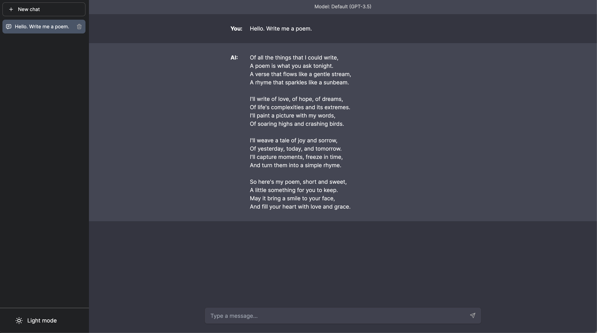

# Advanced Genie AI Chatbot UI 2.0.1



## Updates

Advanced Chatbot UI will be updated over time.

Expect frequent improvements.

**Next up:**

- [ ] Delete messages
- [ ] More model settings
- [ ] Plugins

**Recent updates:**

- [x] Prompt templates (4/11/23)
- [x] Regenerate & edit responses (4/13/23)
- [x] Folders (4/12/23)
- [x] Search chat content (4/12/23)
- [x] Stop message generation (4/12/23)
- [x] Import/Export chats (4/25/23)
- [x] Custom system prompt (4/27/23)
- [x] Error handling (4/27/23)
- [x] GPT-4 support (access required) (4/27/23)
- [x] Search conversations (4/27/23)
- [x] Code syntax highlighting (4/27/23)
- [x] Toggle sidebar (4/27/23)
- [x] Conversation naming (4/27/23)
- [x] Github flavored markdown (4/23/23)
- [x] Add OpenAI API key in app (4/23/23)
- [x] Markdown support (4/23/23)

## Modifications

Modify the chat interface in `components/Chat`.

Modify the sidebar interface in `components/Sidebar`.

Modify the system prompt in `utils/index.ts`.

## Running Locally

**1. Install Dependencies**

```bash
npm i
```

```bash
yarn install
```

**2. Provide OpenAI API Key**

Create a .env.local file in the root of the repo with your OpenAI API Key:

```bash
OPENAI_API_KEY=YOUR_KEY
```

> You can set `OPENAI_API_HOST` where access to the official OpenAI host is restricted or unavailable, allowing users to configure an alternative host for their specific needs.

> Additionally, if you have multiple OpenAI Organizations, you can set `OPENAI_ORGANIZATION` to specify one.

**3. Run App**

```bash
yarn build
```

```bash
npm build
```

```bash
yarn run start
```

```bash
npm run start
```

```bash
yarn run dev
```

```bash
npm run dev
```

**3. Use It**

You should be able to start chatting.

## Deploy

**Docker**

Build locally:

```shell
docker build -t chatgpt-ui .
docker run -e OPENAI_API_KEY=xxxxxxxx -p 3000:3000 chatgpt-ui
```

Pull from ghcr:

```
docker run -e OPENAI_API_KEY=xxxxxxxx -p 3000:3000 ghcr.io/mckaywrigley/chatbot-ui:main
```

## Configuration

When deploying the application, the following environment variables can be set:

| Environment Variable | Default value   | Description                                             |
| -------------------- | --------------- | ------------------------------------------------------- |
| OPENAI_API_KEY       |                 | The default API key used for authentication with OpenAI |
| DEFAULT_MODEL        | `gpt-4.0-turbo` | The default model to use on new conversations           |

If you do not provide an OpenAI API key with `OPENAI_API_KEY`, users will have to provide their own key.
If you don't have an OpenAI API key, you can get one [here](https://platform.openai.com/account/api-keys).

## Contributors

<!-- ALL-CONTRIBUTORS-LIST:START - Do not remove or modify this section -->
<!-- prettier-ignore-start -->
<!-- markdownlint-disable -->
<table>
  <tbody>
    <tr>
      <td align="center" valign="top" width="14.28%"><a href="https://github.com/Michael-Tanzer"><br /><sub><b>Michael Tanzer</b></sub></a><br /><a href="#ideas-Michael-Tanzer" title="Ideas, Planning, & Feedback">🤔</a> <a href="https://github.com/Niek/chatgpt-web/commits?author=Michael-Tanzer" title="Code">💻</a></td>
      <td align="center" valign="top" width="14.28%"><a href="https://github.com/petergeneric"><br /><sub><b>Peter</b></sub></a><br /><a href="#ideas-petergeneric" title="Ideas, Planning, & Feedback">🤔</a></td>
      <td align="center" valign="top" width="14.28%"><a href="https://danb.me"><br /><sub><b>Dan Brown</b></sub></a><br /><a href="#ideas-ssddanbrown" title="Ideas, Planning, & Feedback">🤔</a> <a href="https://github.com/Niek/chatgpt-web/commits?author=ssddanbrown" title="Code">💻</a></td>
      <td align="center" valign="top" width="14.28%"><a href="https://github.com/littlemoonstones"><br /><sub><b>littlemoonstones</b></sub></a><br /><a href="https://github.com/Niek/chatgpt-web/commits?author=littlemoonstones" title="Code">💻</a> <a href="#ideas-littlemoonstones" title="Ideas, Planning, & Feedback">🤔</a></td>
      <td align="center" valign="top" width="14.28%"><a href="https://github.com/maxrye1996"><br /><sub><b>maxrye1996</b></sub></a><br /><a href="https://github.com/Niek/chatgpt-web/issues?q=author%3Amaxrye1996" title="Bug reports">🐛</a></td>
      <td align="center" valign="top" width="14.28%"><a href="https://github.com/Mikemansour"><br /><sub><b>Mikemansour</b></sub></a><br /><a href="#ideas-Mikemansour" title="Ideas, Planning, & Feedback">🤔</a></td>
      <td align="center" valign="top" width="14.28%"><a href="https://github.com/abc91199"><br /><sub><b>abc91199</b></sub></a><br /><a href="#ideas-abc91199" title="Ideas, Planning, & Feedback">🤔</a></td>
    </tr>
    <tr>
      <td align="center" valign="top" width="14.28%"><a href="https://github.com/fuegovic"><br /><sub><b>fuegovic</b></sub></a><br /><a href="#ideas-fuegovic" title="Ideas, Planning, & Feedback">🤔</a></td>
      <td align="center" valign="top" width="14.28%"><a href="https://www.liuin.cn"><br /><sub><b>Sixzeroo</b></sub></a><br /><a href="https://github.com/Niek/chatgpt-web/commits?author=Sixzeroo" title="Code">💻</a></td>
      <td align="center" valign="top" width="14.28%"><a href="http://terryoy.github.io/"><br /><sub><b>terryoy</b></sub></a><br /><a href="#ideas-terryoy" title="Ideas, Planning, & Feedback">🤔</a> <a href="https://github.com/Niek/chatgpt-web/commits?author=terryoy" title="Code">💻</a></td>
      <td align="center" valign="top" width="14.28%"><a href="https://www.linkedin.com/in/yang-lyu-902/"><br /><sub><b>Yang Lyu</b></sub></a><br /><a href="https://github.com/Niek/chatgpt-web/issues?q=author%3Ayanglyu902" title="Bug reports">🐛</a></td>
      <td align="center" valign="top" width="14.28%"><a href="https://github.com/ryanhex53"><br /><sub><b>ryanhex53</b></sub></a><br /><a href="https://github.com/Niek/chatgpt-web/commits?author=ryanhex53" title="Code">💻</a> <a href="#design-ryanhex53" title="Design">🎨</a></td>
      <td align="center" valign="top" width="14.28%"><a href="https://github.com/shivan2418"><br /><sub><b>Emil Elgaard</b></sub></a><br /><a href="#ideas-shivan2418" title="Ideas, Planning, & Feedback">🤔</a> <a href="#design-shivan2418" title="Design">🎨</a> <a href="https://github.com/Niek/chatgpt-web/commits?author=shivan2418" title="Code">💻</a></td>
    </tr>
  </tbody>
</table>

<!-- markdownlint-restore -->
<!-- prettier-ignore-end -->

<!-- ALL-CONTRIBUTORS-LIST:END -->
